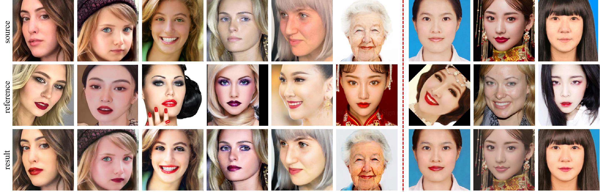

# BeautyREC

This repository contains the official implementation of the following paper:

**BeautyREC:Robust, Efficient, and Component-Specific Makeup Transfer.  **    **CVPRW 2023**

**Paper Link:**  [paper](https://arxiv.org/abs/2212.05855)


# Prepare

The pre-trained model is avaiable at  "./checkpoints/BeautyREC.pt"

vgg_conv.pth: https://drive.google.com/file/d/1CJ2tk-rfG3ox1hRg_RcohcoVsfaJo41j/view?usp=sharing

Put the VGG weights in "./network/REC/"

Data :

MT dataset: https://drive.google.com/file/d/1jP7CpiczZ9KjTQu87PEERrN7BOrxB5St/view?usp=sharing

Wild dataset:https://drive.google.com/file/d/1bQMglioFb50HVwfYaYhVkFXVJIRf42Nm/view?usp=sharing 

Environments: 

```
python >= 3.6
torch >= 1.0
tensorboardX >= 1.6
utils-misc >= 0.0.5
mscv >= 0.0.3
```


# Train 

Put the train-list of makeup images in "./mtdataset/makeup.txt" and the train-list of non-makeup images in "./mtdataset/nomakeup.txt" ( you can randomly split the images.)

train the mt dataset  using "./makeuploader/dataset.py"

train the wild dataset using "./makeuploader/wilddataset.py"

You can init the dataset  in "./makeuploader/dataloaders.py"

```python
CUDA_VISIBLE_DEVICES=0 python train.py --tag mt --model REC 
```


# Test

Put the test-list of makeup images in "./mtdataset/makeup_test.txt" and the test-list of non-makeup images in "./mtdataset/nomakeup_test.txt" 

```python
CUDA_VISIBLE_DEVICES=0 python test.py --model REC  --load checkpoints/BeautyREC.pt
```


# Results



